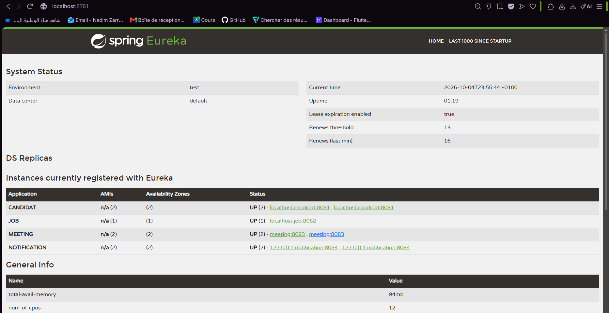

# Atelier Eureka Server - UP_WEB

Applications Web Distribuées - Année universitaire 2026-2027

Tous les microservices s'enregistrent auprès du même serveur Eureka et se retrouvent grâce à leur nom au lieu d'une adresse écrite en dur.

## Équipe

- Zarrouk Nadim
- Oueslati Mohamed
- Manai Samar
- Hajji Aya
- Sahli Omaima

## Architecture

| Microservice | Technologie | Port | Nom dans Eureka |
|---|---|---|---|
| Eureka Server | Spring Boot | 8761 | - |
| Candidat | Spring Boot + H2 | 8081 (2ᵉ instance : 8091) | CANDIDAT |
| Job | Spring Boot + MySQL | 8082 | JOB |
| Meeting | Node.js / Express | 8083 (2ᵉ instance : 8093) | MEETING |
| Notification | Python / FastAPI | 8084 (2ᵉ instance : 8094) | NOTIFICATION |

## 


Les quatre services sont visibles en même temps, avec deux instances de CANDIDAT, MEETING et NOTIFICATION.


## Prérequis

- Java 17+ et Maven
- Node.js 20+
- Python 3.10+
- MySQL démarré (pour le service Job)

## Lancer le projet

Ordre de démarrage : **Eureka**, puis **Candidat** et **Job**, puis **Meeting** et **Notification**.
Un service peut mettre jusqu'à 30 secondes avant d'apparaître dans le dashboard.

### 1. Eureka Server (port 8761)

```bash
cd eureka
mvn spring-boot:run
```

Dashboard : http://localhost:8761

### 2. Candidat (8081) et Job (8082)

```bash
cd candidat
mvn spring-boot:run

cd job
mvn spring-boot:run
```

2ᵉ instance de Candidat sur le port 8091 :

```bash
mvn spring-boot:run -Dspring-boot.run.arguments=--server.port=8091
```

### 3. Meeting - Node.js (8083)

```bash
cd meeting
npm install
node src/server.js
```

2ᵉ instance (PowerShell) :

```powershell
$env:PORT=8093; node src/server.js
```

### 4. Notification - Python (8084)

```powershell
cd notification
python -m venv venv
venv\Scripts\activate
pip install -r requirements.txt
python -m uvicorn app.main:app --port 8084
```

2ᵉ instance (nouveau terminal, venv activé). Le port de `PORT` doit être le même que celui d'Uvicorn :

```powershell
$env:PORT=8094; python -m uvicorn app.main:app --port 8094
```

## Vérification

| Service | URL |
|---|---|
| Dashboard Eureka | http://localhost:8761 |
| Meeting - hello | http://localhost:8083/api/meetings/hello |
| Meeting - health | http://localhost:8083/health |
| Notification - hello | http://localhost:8084/api/notifications/hello |
| Notification - health | http://localhost:8084/health |

## Configuration Eureka

### Clients Spring Boot (Candidat, Job)

```properties
spring.application.name=candidat
server.port=8081
eureka.client.service-url.defaultZone=http://localhost:8761/eureka
eureka.client.register-with-eureka=true
eureka.client.fetch-registry=true
```

### Meeting (Node.js)

Bibliothèque : `eureka-js-client`. Le service s'enregistre sous le nom `MEETING` au démarrage, lit son port dans la variable d'environnement `PORT` et se désenregistre proprement à l'arrêt (signal `SIGINT`).

### Notification (Python)

Bibliothèque : `py-eureka-client`. Le service s'enregistre sous le nom `NOTIFICATION` dans l'événement `lifespan` de FastAPI et s'arrête proprement avec l'application.

## Bonus réalisé

- Endpoint `GET /health` ajouté à Meeting et Notification, déclaré comme `healthCheckUrl` dans Eureka.